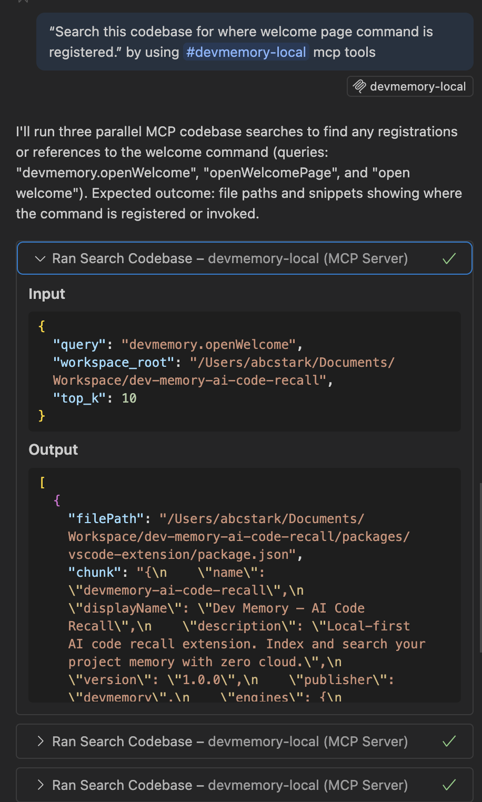
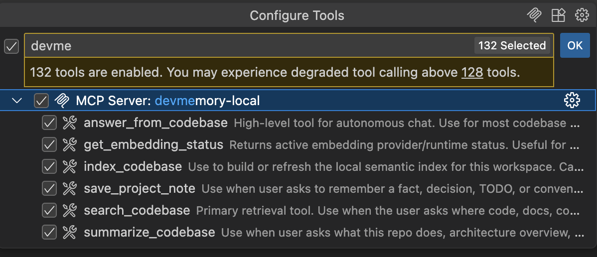

# Dev Memory — AI Code Recall

Dev Memory is a local-first memory engine for AI coding workflows.

It indexes your workspace into a local semantic store and serves recall through MCP and a VS Code extension, so coding agents and humans can query project knowledge in natural language.

## Value Proposition

- Zero cloud dependency for core retrieval workflow
- Better AI code recall with local semantic search
- Faster developer onboarding and debugging through project memory
- Built for MCP-native agent ecosystems

## Why It Is Helpful for Developers

- Reduces “where is this implemented?” hunting time
- Keeps responses grounded in your repository, not generic model priors
- Works across mixed-language repos
- Preserves privacy for proprietary code

## Why It Can Be Lucrative

- Clear ROI for teams: reduced engineering hours lost to context lookup
- Strong fit for enterprise buyers requiring local/private-first tooling
- MCP integration makes it sticky in agent-based developer workflows
- Expandable into paid offerings: team memory sync, governance, enterprise controls

## Current Status (Implemented)

- Local embeddings via `@xenova/transformers` (WASM path, dynamic loading)
- Local vector store with cosine search at `.dev-memory/index.json`
- MCP tools:
  - `index_codebase`
  - `search_codebase`
  - `summarize_codebase`
  - `save_project_note`
  - `get_embedding_status`
  - `answer_from_codebase`
- VS Code extension:
  - Starts bundled MCP server
  - Registers workspace MCP config in `.vscode/mcp.json`
  - Welcome webview for index + search
  - Embedding provider visibility in UI (`xenova-wasm` vs fallback)
  - `Dev Memory: Open Welcome Page` command

## Tech Stack

- TypeScript monorepo (`packages/core`, `packages/mcp-server`, `packages/vscode-extension`)
- VS Code Extension API
- MCP SDK (`@modelcontextprotocol/sdk`)
- Local embeddings: `@xenova/transformers` + `onnxruntime-web`
- Local persistence: JSON index file (workspace-local)
- Build/packaging: TypeScript + esbuild + VSCE

## Branding and Screenshots

Logo files:

- `assets/branding/dev-memory-logo.svg`
- `assets/branding/dev-memory-brain-techy.svg`
- `assets/branding/dev-memory-brain-techy-128.png`
- `packages/vscode-extension/assets/logo/dev-memory-logo.svg`

Screenshot folders:

- `assets/screenshots/`
- `packages/vscode-extension/assets/screenshots/`

Recommended screenshot names:

- `01-welcome-page.png`
- `02-index-in-progress.png`
- `03-search-results.png`
- `04-embedding-status.png`
- `05-copilot-mcp-example.png`


### Preview Screenshots

Current images are placeholders. Replace with real product screenshots.





## Monorepo Layout

```text
packages/
  core/             # @devmemory/core
  mcp-server/       # @devmemory/mcp
  vscode-extension/ # VS Code extension
```

## Core Behavior

`@devmemory/core` provides:

- File ingestion with filtering
- Chunking
- Embedding generation
- JSON-backed vector persistence
- Semantic search and note memory APIs

Storage is workspace-local:

- `.dev-memory/index.json` (vectors + metadata)

## MCP Server

`@devmemory/mcp` uses the official MCP SDK over stdio.

Example: list tools

```bash
echo '{"jsonrpc":"2.0","id":1,"method":"tools/list","params":{}}' \
  | node packages/mcp-server/dist/index.js
```

Example: codebase search

```bash
echo '{"jsonrpc":"2.0","id":2,"method":"tools/call","params":{"name":"search_codebase","arguments":{"query":"indexing flow","top_k":5,"workspace_root":"/path/to/workspace"}}}' \
  | node packages/mcp-server/dist/index.js
```

## Copilot + MCP Usage

When using GitHub Copilot Chat with MCP enabled, select `#devmemory-local` and ask normal codebase questions.

Verified prompt style:

- `Search this codebase for where welcome page command is registered.`

Recommended prompts:

- `Search this codebase for how indexing works.`
- `Summarize this repository architecture.`
- `Answer from codebase: where is search_codebase implemented?`

## VS Code Extension

Commands:

- `Dev Memory: Index Project`
- `Dev Memory: Search Project Memory`
- `Dev Memory: Open Welcome Page`

Notes:

- Indexing is explicit/manual today.
- After VS Code reload, rerun indexing before searching.

## Packaging Model (Single VSIX)

The extension packages:

- `dist/extension.js`
- `dist/mcp-server.bundle.js`
- `dist/runtime/node_modules/...` runtime deps for Xenova/ONNX WASM

This allows one VSIX artifact to run without asking users to build native modules locally.

## Build and Package

From repo root:

```bash
npm --prefix packages/core run build
npm --prefix packages/mcp-server run build
npm --prefix packages/vscode-extension run build
node packages/vscode-extension/scripts/bundle-mcp.js
cd packages/vscode-extension && npm run package
```

VSIX output:

- `packages/vscode-extension/.vsce-dist/devmemory-ai-code-recall-1.0.0.vsix`

## Not in Scope Today

- LanceDB is not used in the current runtime
- Native ONNX runtime packaging is not required for normal usage

## Privacy

- 100% local execution
- No API keys
- No cloud calls required for core workflow

## License

MIT
