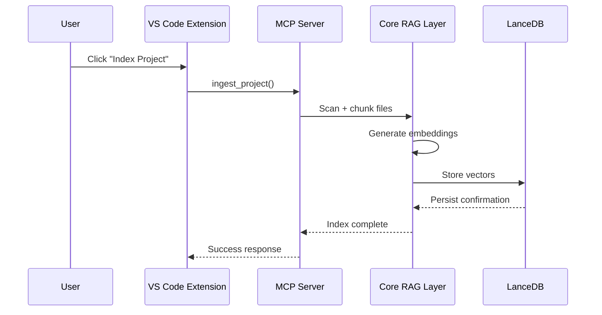
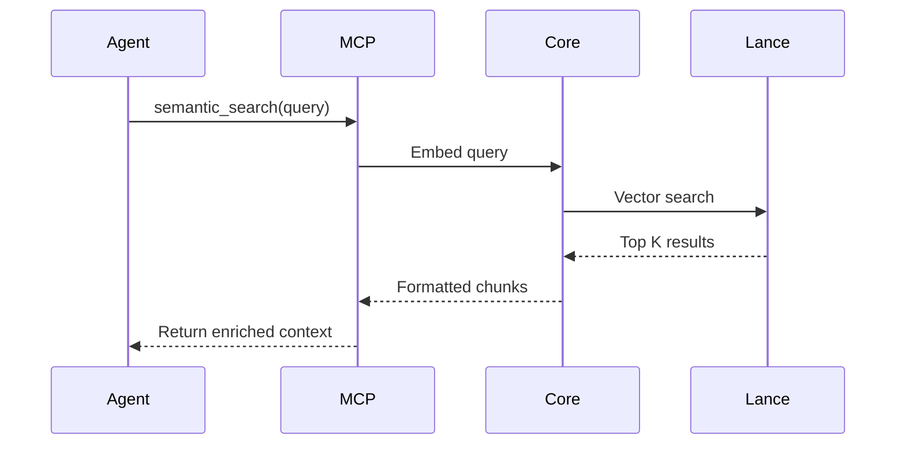

# Dev Memory — AI Code Recall

Dev Memory is a local-first AI memory engine that provides persistent,
semantic recall for your codebase. It enables fast, private, and offline
semantic search over your project by embedding source files into a local
vector store (JSON‑backed cosine similarity) and exposing a small MCP server for integration with
agents and the included VS Code extension.

Key principles:
-  Local-first: no cloud services, no API keys.
-  Zero-config: works with plain workspaces and writes storage inside the
  workspace under `.dev-memory/index.json`.
-  Developer-focused UX: tight VS Code integration, easy re-index and search.

------------------------------------------------------------------------

# 🏗 Monorepo Architecture

Repository name:

dev-memory-ai-code-recall/

Structure:

dev-memory-ai-code-recall/ │ ├── package.json ├── turbo.json ├──
tsconfig.base.json │ ├── packages/ │ ├── core/ \# @devmemory/core │ ├──
mcp-server/ \# @devmemory/mcp │ └── vscode-extension/ \# Dev Memory ---
AI Code Recall │ ├── storage/ \# LanceDB persistent storage └──
README.md

------------------------------------------------------------------------

# 📦 Package Naming

Core Library: @devmemory/core

MCP Server: @devmemory/mcp

VS Code Extension Marketplace Name: Dev Memory --- AI Code Recall

Extension Identifier: devmemory.ai-code-recall

------------------------------------------------------------------------

# 🔄 Sequence Diagrams

## Project Indexing Flow



------------------------------------------------------------------------

## Agent Semantic Search Flow



------------------------------------------------------------------------


# Core responsibilities (what the product does)

- File ingestion and robust filtering (skips node_modules, build artifacts,
  binaries, etc.)
- Chunking (splits long files into searchable passages)
- Local embeddings using Xenova transformer pipelines
- Persistent vector storage in `.dev-memory/index.json` using cosine similarity
- Semantic search and simple note remembering APIs

API (library)

```ts
// Ingests all relevant files in a project, skipping dependencies and build artifacts
async function ingestProject(rootPath: string): Promise<void>

// Performs semantic search over indexed chunks
async function semanticSearch(query: string, k?: number, rootPath?: string): Promise<SearchResult[]>
```

## Folder/File Filtering Logic

- Only source code, README, and test files are ingested
- Excludes common dependency, build, and artifact folders:
  - node_modules, dist, .git, .venv, build, target, __pycache__, .idea, .vscode, *.egg-info, *.class, *.jar, *.pyc, .DS_Store, *.lock, *.log, *.tmp, *.bak, *.swp, *.swo, *.out, *.bin, *.exe, *.dll, *.obj, *.o, *.a, *.so, *.dylib, *.zip, *.tar, *.gz, *.bz2, *.xz, *.7z, *.pdf, *.png, *.jpg, *.jpeg, *.gif, *.svg, *.mp3, *.mp4, *.mov, *.avi, *.mkv, *.webm, *.iso, *.dmg, *.app, *.apk, *.ipa, *.csv, *.tsv, *.db, *.sqlite, *.env, *.sample
- Filtering is enforced both via glob ignore and post-processing to ensure no forbidden files are processed
- This prevents accidental ingestion of large, irrelevant, or binary files and keeps the memory engine focused on meaningful project content

## Filtering Challenge

Glob ignore patterns alone may not work reliably with absolute paths or deeply nested folders. To guarantee exclusion, a post-filter step checks each file path for forbidden segments before processing. This ensures bulletproof filtering for all project types (Node.js, Python, Java, etc.) and keeps ingestion fast and relevant.

------------------------------------------------------------------------


# MCP Server (@devmemory/mcp)

The MCP server exposes a small set of tools using the official Model Context
Protocol SDK (`@modelcontextprotocol/sdk`). The server communicates over
stdin/stdout using the MCP JSON-RPC wire format and is discoverable by
MCP-compatible hosts and inspectors.

Tools provided by the server (examples):
- `ingest_project` — index a workspace into `.dev-memory/index.json`
- `semantic_search` — run a query against an indexed project (accepts `rootPath`)
- `remember_note` — persist small notes into a separate table
- `project_summary` — produce a short summary of the project

Important notes:
- The server now uses the official MCP SDK and advertises tools via
  `tools/list` and accepts calls via `tools/call` JSON-RPC methods.
- The legacy ad-hoc protocol that accepted `{ "tool": "name", "params": { ... } }`
  messages has been removed — please use the MCP JSON-RPC endpoints.
- MCP requests which operate on the DB must include the `rootPath` parameter
  so the server reads/writes the workspace index at `rootPath/.dev-memory/index.json`.

------------------------------------------------------------------------

## Testing the MCP server (local)

Prerequisites: install runtime deps for the MCP server package (only needs to
be done once per workspace):

```bash
npm --prefix packages/mcp-server install @modelcontextprotocol/sdk zod
```

Build and run the server (compiled JS):

```bash
npm --prefix packages/mcp-server run build
node packages/mcp-server/dist/index.js
```

Or run directly from TypeScript in dev with tsx:

```bash
npx tsx packages/mcp-server/src/index.ts
```

Tools discovery example (request a list of registered tools):

```bash
echo '{"jsonrpc":"2.0","id":1,"method":"tools/list","params":{}}' \
  | node packages/mcp-server/dist/index.js
```

Call a tool (JSON-RPC `tools/call`) — example calling `semantic_search`:

```bash
echo '{"jsonrpc":"2.0","id":2,"method":"tools/call","params":{"name":"semantic_search","arguments":{"query":"readme","k":5,"rootPath":"/path/to/your/workspace"}}}' \
  | node packages/mcp-server/dist/index.js
```

Notes:
- The server writes diagnostic logs to stderr and returns JSON-RPC responses on stdout.
- If you use the bundled server distributed with the VS Code extension, point your host to the bundled bundle or let the extension register it automatically in `.vscode/mcp.json`.

------------------------------------------------------------------------

------------------------------------------------------------------------

# VS Code extension

Name: Dev Memory — AI Code Recall

What it does:
- Starts the MCP server (bundled with the extension when available) and
  registers a workspace-level MCP entry in `.vscode/mcp.json`.
- Provides two main commands in the command palette:
  - `Dev Memory: Index Project` — runs `ingest_project` for the current workspace
  - `Dev Memory: Search Project Memory` — prompts for a query and runs `semantic_search`

Important operational note
--------------------------
Currently, the extension does not persist a live incremental index across
VS Code host reloads. That means after you reload the window (or restart the
extension host) you must manually re-run `Dev Memory: Index Project` to
recreate the workspace index before search will return results. Put another
way: indexing is explicit and manual today. We surface a clear warning in the
UI and the output channel to remind you to re-index when relevant.

------------------------------------------------------------------------

# 🧱 Production-Grade Folder Structure

dev-memory-ai-code-recall/ │ ├── packages/ │ ├── core/ │ │ ├──
package.json │ │ ├── tsconfig.json │ │ └── src/ │ │ ├── ingest.ts │ │
├── embed.ts │ │ ├── vector-store.ts │ │ └── search.ts │ │ │ ├──
mcp-server/ │ │ ├── package.json │ │ ├── tsconfig.json │ │ └── src/ │ │
├── index.ts │ │ ├── server.ts │ │ └── tools/ │ │ ├── ingest.ts │ │ ├──
search.ts │ │ └── summary.ts │ │ │ └── vscode-extension/ │ ├──
package.json │ ├── tsconfig.json │ ├── src/ │ │ ├── extension.ts │ │ └──
mcpLauncher.ts │ └── assets/

------------------------------------------------------------------------

# 📦 Root package.json

``` json
{
  "name": "dev-memory-ai-code-recall",
  "private": true,
  "workspaces": ["packages/*"],
  "scripts": {
    "build": "turbo build",
    "dev": "turbo dev",
    "lint": "turbo lint"
  },
  "devDependencies": {
    "turbo": "^2.0.0",
    "typescript": "^5.0.0"
  }
}
```

------------------------------------------------------------------------

# 📦 @devmemory/core package.json

``` json
{
  "name": "@devmemory/core",
  "version": "1.0.0",
  "main": "dist/index.js",
  "types": "dist/index.d.ts",
  "scripts": {
    "build": "tsc",
    "dev": "tsc -w"
  },
  "dependencies": {
    "@xenova/transformers": "^2.0.0",
    "lancedb": "^0.4.0",
    "glob": "^10.0.0"
  }
}
```

------------------------------------------------------------------------

# 📦 @devmemory/mcp package.json

``` json
{
  "name": "@devmemory/mcp",
  "version": "1.0.0",
  "main": "dist/index.js",
  "scripts": {
    "build": "tsc",
    "start": "node dist/index.js"
  },
  "dependencies": {
    "@devmemory/core": "*"
  }
}
```

------------------------------------------------------------------------

# 📦 VS Code Extension package.json

``` json
{
  "name": "devmemory-ai-code-recall",
  "displayName": "Dev Memory — AI Code Recall",
  "version": "1.0.0",
  "engines": {
    "vscode": "^1.85.0"
  },
  "activationEvents": [
    "onStartupFinished"
  ],
  "main": "./dist/extension.js",
  "scripts": {
    "build": "tsc",
    "package": "vsce package"
  },
  "dependencies": {
    "vscode": "^1.1.37"
  },
  "devDependencies": {
    "@types/vscode": "^1.85.0",
    "typescript": "^5.0.0"
  }
}
```

------------------------------------------------------------------------

# Storage and logs

- Vector database: `.dev-memory/index.json` under the workspace root (JSON file)
- Log file: `.vscode/devmemory.log` inside the workspace (the extension
  appends MCP and launcher logs here so you can tail them with `tail -F`)

If you delete `.dev-memory/index.json` you remove the project's index and will need
to re-run `Index Project` to recreate it.


## Progress & Known Issues (status)

This section documents what has been implemented so far, what remains, and known runtime issues to be aware of.

What we've covered (Done)
- MCP server migrated to the official MCP SDK and now uses newline-delimited JSON over stdio for messages.
- Extension-side MCP client now implements a proper JSON-RPC helper (`sendRpc`) and supports both top-level RPC (`tools/list`) and tool invocation (`tools/call`).
- Tool registration was fixed to pass handlers using the SDK signature (handler is the third arg to `registerTool`).
- `semantic_search` and other tools return results wrapped in the MCP `content` shape; the extension parses `content` (text blocks) into JSON before forwarding to the webview.
- The extension forwards MCP logging notifications (`notifications/message`) to the VS Code Output channel and writes session logs to `.vscode/devmemory.log`.
- The MCP server bundle is produced and packaged into a VSIX. A built VSIX is available at `packages/vscode-extension/.vsce-dist/devmemory-ai-code-recall-1.0.0.vsix`.

Remaining / Partial (Todo)
- Final end-to-end verification in the VS Code Extension Host: activate the extension, Index Project, and confirm search results render in the webview. (You can test by installing the VSIX.)
- Improve index persistence behavior: currently the index is explicit and must be recreated after host reloads (re-run `Index Project`). We may add an incremental or persistent background indexer in a later iteration.
- Add better error and content-shape handling in the webview for malformed or streaming tool outputs.
- Optionally add lightweight unit/integration tests around `mcpLauncher` and the MCP client to assert framing and pending resolution logic.

Known issues and notes
- If you previously upgraded the MCP SDK and lost detailed logs, that was caused by a framing mismatch (Content-Length vs newline framing). The framing issue has been fixed in the client code, and logs are now surfaced to the Output channel.
- Tools must be called correctly: use `tools/list` as a top-level RPC method (via `sendRpc('tools/list')` or `sendMCPRequest(..., { method: 'tools/list' })`) and use `tools/call` to invoke a registered tool by name.
- Indexing is currently manual; if searches return nothing, re-run `Dev Memory: Index Project` (or run the ingest tool with `force: true`).
- The project switched to a simple JSON vector store for local persistence in the current branch; if you rely on LanceDB-specific features please note they are no longer required at runtime.

# 🔐 Privacy

-   100% local
-   No telemetry
-   No API keys
-   No cloud calls

------------------------------------------------------------------------

MIT License
